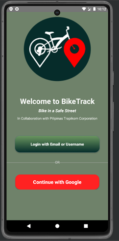
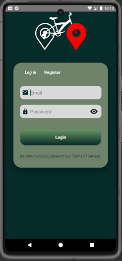
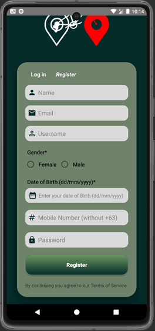
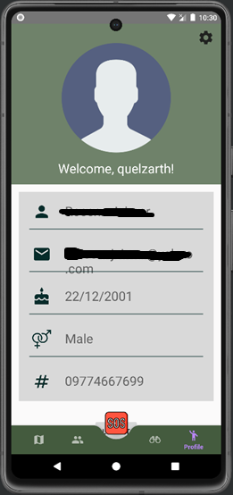
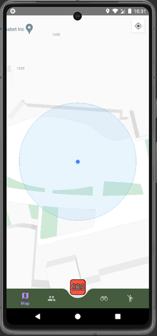

# BikeTrack Mobile Application

A mobile application project that focus on developing the system for the company, Pilipinas Trapikom Corporation. The system will be used to record the data of transportation vehicles 
especially bicycles, to help the traffic flow in the Philippines in urban areas and create a solution for the problems. The project will also be focusing on creating a mobile application 
to record the data and to be a navigation for many cyclists on the road. The system and application will be the goal of the project to help the company in recording the data of many 
transportation vehicles and provide safe and easy navigations to many cyclists.

# 

**BikeTrack: An Innovative Mobile GPS-Enabled Application for Group Biking and Safety**
- Sustainable development goals active within the said project. (Climate action, Sustainable cities and communities, good health).

> **The api, code, and software are now outdated. It is a project for college project management.**

## Prototype Pictures

## Resources
- Firebase = The database for the project. Firebase hold all the data of the users/cyclists.
- Google APIs = The project used the Google Service for the maps to record the location of the user.
- Android Studio = The IDE for the project. (Java Programming Language)
- Android 8-11 = On the production and deployment we used the ranges of 8-11 android version to run the project.

